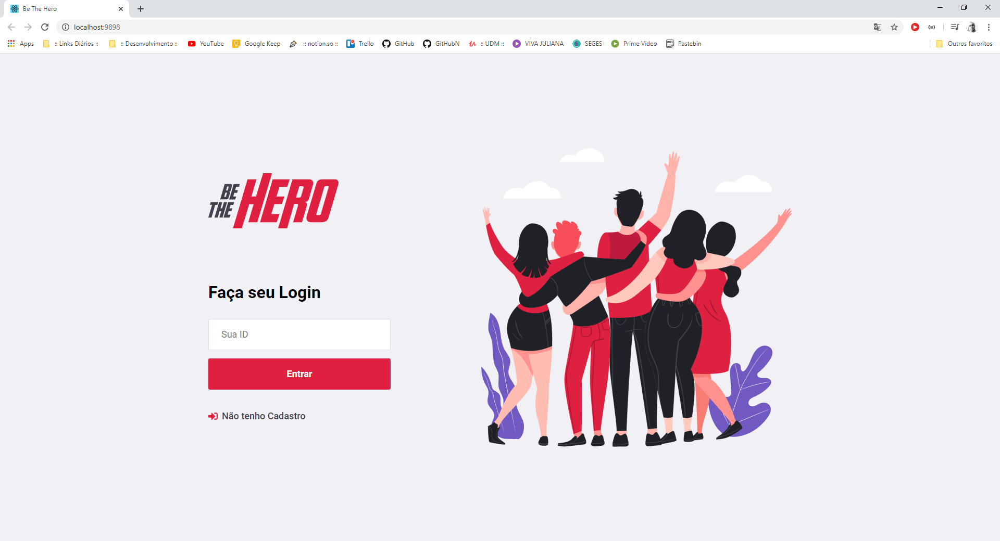
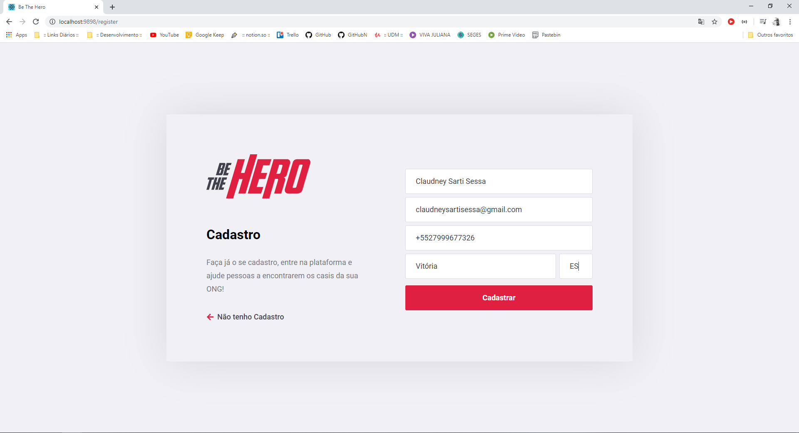
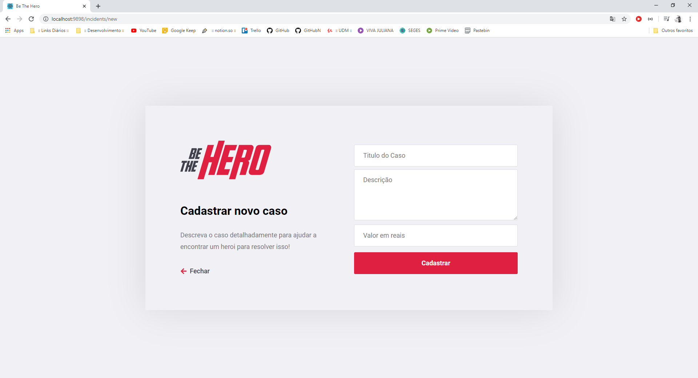
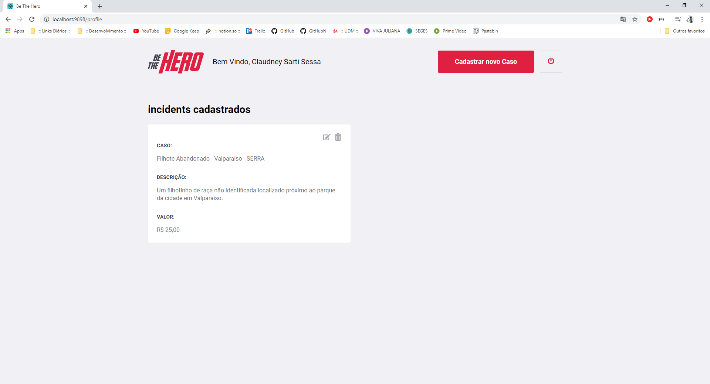

<h1 align="center">
    
</h1>
<h1 align="center">
Semana OmniStack 11.0 RocketSeat - ( Be the Hero )
</h1>
<p align="center">
Desenvolviemto de uma aplicação completa com NodeJS + React + React Native
</p>

<h2 align="center">
</img>
</h2>

## Tecnologia

Esse projeto foi desenvolvido com as seguintes tecnologias:

- [Node.js](https://nodejs.org/en/)
- [React](https://reactjs.org)

## Bibliotecas Utilizadas:

- [Express](https://expressjs.com/pt-br/)
- [Nodemon](https://www.npmjs.com/package/nodemon)
- [KnexJS](http://knexjs.org/)
- [CORS](https://www.npmjs.com/package/cors)
- [sqlite3](https://www.npmjs.com/package/sqlite3)
- [celebrate](https://www.npmjs.com/package/celebrate)
- [jest](https://www.npmjs.com/package/jest)
- [cross-env](https://www.npmjs.com/package/cross-env)
- [supertest](https://www.npmjs.com/package/supertest)
- [eslint](https://www.npmjs.com/package/eslint)
- [Axios](https://www.npmjs.com/package/axios)
- [React Icons](https://react-icons.netlify.com/#/)
- [React Router DOM](https://www.npmjs.com/package/react-router-dom)

## Instalação

Baixe o projeto via download ou clone do repositório no GitHub, caso tenha feito o download do arquivo compactado descompacte o mesmo em uma pasta de fácil acesso e depois execute os passos adicionais descritos abaixo:

- Instale o Chocolatey
- Instale o NodeJS
- Instale o Visual Studio Code

Para iniciar o **Backend**, navegue até a pasta do projeto de backend do NodeJS e utilize os comandos:

```
npm install
npm start
```
Logo estará disponível sua API no endereço `localhost:9999`

Para iniciar o **Frontend**, navegue até a pasta do projeto de Frontend do React utilize os comandos:

```
npm install
npm start
```
Assim que o processo terminar, automaticamente será aberta no seu navegador a página `localhost:9898` contendo o Projeto desenvolvido no dia 3.

## Imagens

Página De Login
</img>
Página de Cadastro
</img>
Página de Cadastro de Ações
</img>
Página de Listagem de Ações
</img>

## Licença

Esse projeto está sob a licença MIT. Veja o arquivo [LICENSE](LICENSE) para mais detalhes.

---

Desenvolvido por **Claudney Sarti Sessa** durante o mini curso da **RocketSeat** em Março de 2020
